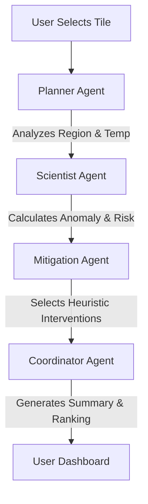

# Agentic AI Urban Mitigation Advisor: Data Feasibility Study

## 1. Executive Summary

This document evaluates the feasibility of building a client-side **Agentic AI Urban Mitigation Advisor** using the existing machine learning (ML) outputs of the **Heat-Forexa** project, without introducing new backend endpoints or retraining the ML model.

### Key Finding
**A rule-based and heuristics-guided Agentic AI Advisor is FULLY FEASIBLE to build immediately using the existing client-side data exports, but a scientifically validated ML-based cooling simulation is NOT SUPPORTED.**

The existing XGBoost model is trained strictly on meteorological time series, calendar cycles, and generic spatial lags. It has no physical surface inputs (e.g., albedo, tree canopy, land use). Consequently, any simulated cooling offsets (e.g., `-1.2°C` for trees) must rely on predefined static lookups or expert heuristics. Legitimate machine learning inference cannot evaluate these interventions, and presenting simulated cooling outputs as direct "ML model predictions" would constitute scientific overclaiming. 

However, by combining the existing high-resolution temperature predictions with a deterministic client-side heuristic engine, we can construct an engaging and helpful advisor that functions entirely without a backend.

---

## 2. Existing ML/Data Architecture

The current Heat-Forexa ML pipeline functions as a daily delta-temperature forecasting system:
1. **Data Ingestion**: Standard meteorological data (from Open-Meteo) containing temperature, wind speed, solar radiation, apparent temperature, and precipitation.
2. **Feature Engineering**:
   - **Temporal Lags**: Shifted historical temperatures (`lag_1` to `lag_7`) and rolling statistics.
   - **Cyclic Calendar**: Sin/Cos encoding of day of year, day of month, day of week.
   - **Spatial Lags**: k-Nearest Neighbors (k=5 neighbors) to aggregate neighboring tile lag temperatures via inverse-distance weightings.
3. **Modeling**: An XGBoost Regressor predicting the daily temperature delta ($T_{t+1} - T_t$).
4. **Data Exports**: The backend exports static JSON payloads to the frontend public directory (`frontend/public/data/`):
   - `coordinate_registry.json`: Grid definition including deterministic, pseudo-random "regime" labels.
   - `forecast_2027_summary.json`: 2027 temperature projections.
   - `historical_comparison.json`: Temperature records for 2024-2027.
   - `model_metrics.json` & `causal_insights.json`: Validation statistics.

---

## 3. Existing Prediction Output

The exported `forecast_2027_summary.json` provides a 61-day forecast (June 1st to July 31st, 2027) mapped per tile.
- **Form**: Dictionary keyed by `tile_id` string mapping to a list of 61 float values representing daily temperature predictions.
- **Resolution**: 30m² spatial grids covering Downtown Miami / Brickell.
- **Baseline**: The forecast is generated by projecting a macro weather fluctuation delta + warming trend ($+0.3^\circ\text{C}$) onto 2026 tile averages.

---

## 4. Complete Available Data/Column Inventory

Based on an audit of the files in `data/processed/cleaned_data.csv`, `features.csv`, and output result files, the following table lists all available variables:

| Column Name | Data Type | Range/Example | ML Input Feature? | ML Output? | Useful for Risk Analysis? | Useful for Mitigation? | Supports Simulation? | Limitations |
| :--- | :--- | :--- | :--- | :--- | :--- | :--- | :--- | :--- |
| `tile_id` | Integer | `0 - 2186` | No | No | Yes (Index) | Yes (Index) | No | Abstract identifier; no physical meaning |
| `timestamp` | String | `"2024-06-01"` | No | No | Yes | No | No | Temporal index only |
| `latitude` | Float | `25.75282` | No | No | Yes (Spatial) | Yes (Spatial) | No | Geographic index; no physical properties |
| `longitude` | Float | `-80.22702` | No | No | Yes (Spatial) | Yes (Spatial) | No | Geographic index; no physical properties |
| `temperature` | Float | `22.8 - 36.4` | Yes (as lag) | Yes (Reconstructed) | Yes (Core indicator) | Yes | No | Represents absolute air temperature; lacks thermal comfort indices |
| `temperature_2m_mean/max/min` | Float | `22.5 - 34.0` | Yes | No | Yes (Ambient baseline) | No | No | Regional meteorological baseline; no microclimate variance |
| `apparent_temperature_mean/max/min`| Float | `25.0 - 42.0` | Yes | No | Yes (Thermal comfort) | No | No | Regional comfort index; no tile-level microclimate variation |
| `precipitation_sum / rain_sum` | Float | `0.0 - 45.2` | Yes | No | Yes (Cooling factor) | No | No | Regional weather baseline |
| `wind_speed / wind_gusts` | Float | `5.0 - 58.0` | Yes | No | Yes (Advection baseline) | No | No | Regional; no micro-level wind obstacles |
| `shortwave_radiation_sum` | Float | `5.0 - 32.0` | Yes | No | Yes (Solar load) | No | No | Regional solar radiation; no local shading/building shadows |
| `sunshine_duration` | Float | `0 - 46800` | Yes | No | Yes | No | No | Regional daily baseline |
| `regime` (in coordinate registry) | String | `"Urban Park"` | No | No | Yes (Categorical proxy) | Yes (Categorical proxy) | No | **Synthetic.** Generated by temperature thresholds and coordinate hashing; not a physical GIS input. |

---

## 5. Heat-Risk Analysis Capability

The existing data **fully supports** basic heat-risk classification. We can dynamically calculate:
1. **Absolute Thresholds**: Assessing risk based on absolute temperature (e.g. Extreme if $> 33^\circ\text{C}$, High if $> 31^\circ\text{C}$).
2. **Spatial Anomalies**: Calculating how much hotter a specific tile is compared to the metropolitan baseline on any given day ($T_{\text{tile}} - \mu_{\text{metro}}$).
3. **Apparent Heat Indices**: While apparent temperature is only available as a macro regional baseline in the raw data, we can estimate tile-level apparent temperature locally by applying the regional humidity and wind speeds to the tile's predicted air temperature.

---

## 6. Spatial Analysis Capability

### Geographic Specificity
We have `tile_id`, `latitude`, and `longitude` coordinates for 2,187 tiles. This enables the advisor to provide geographically localized recommendations.

### Spatial Constraints & Relationships
The dataset contains precalculated distance matrices and spatial lags (`spatial_nbr_lag1_mean`). This allows the agent to inspect whether a tile is located within a hot cluster (active Urban Heat Island core) or adjacent to a cool zone (Coastal Breeze Zone).

### Limitations
We **do not** have physical environmental inputs (e.g., actual building height, street width, water proximity, or vegetation fraction). The spatial relationships are represented purely through temperature correlations.

---

## 7. Mitigation Recommendation Feasibility

We cannot make recommendations based on real physical variables (e.g. recommending reflective roofs because a building has a low albedo roof), as those variables are not in our database. 

However, we **can** make recommendations based on the **assigned regime proxy** and **heat severity anomalies**:
- **Regime-based matching**: Standard rules select cool roofs for "Commercial District" tiles, urban forestry for "Residential Canopy" tiles, and eco-parks for "Coastal Breeze Zone" / "Urban Park" tiles.
- **Severity-based scaling**: High-priority alerts and expensive, high-impact suggestions are reserved for UHI cores with high spatial anomalies.

---

## 8. Intervention-by-Intervention Analysis

| Intervention | Status | Available Data | Missing Physical Data | Why / How Recommendation is Supported |
| :--- | :--- | :--- | :--- | :--- |
| **1. Urban Forestry / Canopy** | **PARTIALLY SUPPORTED** | Tile ID, Temperature, Regime proxy (synthetic). | Existing vegetation indices (NDVI), canopy percentage, available planting area. | We can recommend trees based on heat anomalies and the synthetic "Residential Canopy" regime tag, but cannot verify if the tile actually lacks tree cover. |
| **2. Permeable Pavement** | **PARTIALLY SUPPORTED** | Coordinate coordinates, Regime proxy. | Soil type, impervious surface percentage, road/sidewalk layout. | Recommended as a general cooling measure for "Commercial" or "Residential" regime classes to reduce surface heat retention. |
| **3. Rain Gardens** | **PARTIALLY SUPPORTED** | Precipitation sum, Regime proxy. | Local runoff patterns, soil permeability, topography. | Recommended in regions with high precipitation baselines to control runoff and promote evapotranspiration cooling. |
| **4. Green Roofs** | **PARTIALLY SUPPORTED** | Temperature, shortwave radiation sum, Regime. | Building structural load capability, roof surface area, current roof type. | Recommended for highly urbanized commercial tiles experiencing extreme solar radiation. |
| **5. Cool / Reflective Roofs**| **PARTIALLY SUPPORTED** | Shortwave radiation sum, Temperature. | Roof albedo, building density, roof orientation. | Recommended for solar-exposed commercial/industrial structures. |
| **6. Eco-Park / Green Buffers** | **PARTIALLY SUPPORTED** | Regime proxy ("Urban Park"). | Local zoning, land ownership, vegetation structure, soil health. | Recommended for expanding/enhancing existing park borders. |
| **7. Shade Structures** | **PARTIALLY SUPPORTED** | Temperature, sunshine duration, radiation. | Pedestrian traffic density, building layouts (street canyons). | Recommended for highly exposed commercial tiles to lower thermal comfort indices (apparent temperature). |

---

## 9. Cooling Simulation Feasibility

### A. Actual ML Prediction Capability: **NOT SUPPORTED**
The current XGBoost model has **no input variables representing interventions**. It was trained on features like $T_{t-k}$, $T_{2m}$, radiation, and precipitation. It does not recognize albedo ($\alpha$), normalized difference vegetation index ($\text{NDVI}$), or building density.
- If we pass a modified dataset to the model, we cannot simulate an intervention because there is no feature we can alter to represent "planting trees" or "painting roofs white".
- Therefore, the ML model **cannot** compute a new predicted temperature after intervention.

### B. Rule-Based / Heuristic Sandbox: **FULLY FEASIBLE**
We can simulate cooling impacts on the client side using a **deterministic heuristic engine** (similar to the current advisor mock-up):
- Each selected intervention carries a static temperature reduction value (e.g., Cool Roof = $-0.6^\circ\text{C}$, Urban Forestry = $-1.2^\circ\text{C}$).
- When selected, the client-side UI subtracts this offset from the forecasted temperature array locally.
- **Caution**: This is a rule-based demo, not an ML prediction. It must be explicitly labeled as a *"Heuristic Estimate"* to avoid scientific overclaiming.

### What is Required for Legitimate ML-Based Simulation?
To make cooling simulations scientifically meaningful within the ML pipeline, we would need to:
1. **Collect GIS/Remote Sensing Data**: Gather tile-level physical features (NDVI/vegetation fraction, albedo, sky view factor, building height, impervious surface fraction).
2. **Retrain the XGBoost Model**: Include these physical attributes as input features alongside the meteorological variables.
3. **Simulate Interventions**: To simulate an intervention (e.g., painting roofs), we would modify the albedo feature value in the tile's input vector and pass the modified vector to the XGBoost model to obtain the simulated temperature prediction.

---

## 10. Agentic AI Feasibility

If we run an LLM agentic layer locally (e.g., using lightweight client-side models or mock reasoning scripts), the agents can perform the following tasks:



### Agent Roles & Feasibility Summary
- **Planner Agent**: **PARTIALLY POSSIBLE**. Can analyze the geographic coordinates, temporal trends, and the synthetic regime tag of a tile. It cannot analyze real zoning constraints or physical geometries.
- **Scientist Agent**: **FULLY POSSIBLE**. Can compute spatial anomalies ($T_{\text{tile}} - \mu_{\text{metro}}$), identify temperature trend changes, and classify tiles into heat-risk categories (Low, Moderate, High, Extreme).
- **Mitigation Agent**: **PARTIALLY POSSIBLE**. Can recommend urban cooling strategies from a static lookup catalog mapped to the tile's synthetic regime and severity level.
- **Coordinator Agent**: **FULLY POSSIBLE**. Can compile, rank, and format the recommended interventions, presenting them as a structured mitigation plan.

---

## 11. What We Can Build NOW (No Backend, No Retraining)

1. **Local Heuristic Advisor**: A client-side reasoning engine (running in Javascript) that reads `coordinate_registry.json` and daily forecasts to analyze the active tile.
2. **Dynamic Scenario Sandbox**: Interactive toggles representing cool roofs, permeable pavements, and tree planting. Selecting an option subtracts a predefined offset from the predicted temperature curve locally.
3. **Simulated Before/After Visualizations**: A side-by-side comparison on the spatiotemporal map and historical charts showing the baseline predicted forecast line vs. the offset-adjusted forecast line.
4. **Agent Collaboration Interface**: A terminal UI simulating the Planner, Scientist, and Mitigation agents "collaborating" (evaluating anomalies and selecting recommendations) to create a premium user experience.

---

## 12. What We CANNOT Reliably Build NOW

1. **Dynamic Physical Simulations**: We cannot calculate custom cooling impacts based on physical scale (e.g., "planting exactly 45 trees on this block").
2. **Validated Microclimate Feedback**: We cannot evaluate how cooling in one tile affects neighboring tiles (no spatial thermal diffusion model).
3. **Real-world Zoning Suitability**: We cannot guarantee that a recommended intervention (like building an eco-park) is physically or legally possible on that specific tile.

---

## 13. Data Gaps

To bridge the gap between heuristic mockups and actual scientific calculations, the following datasets must be acquired and joined to the tile grid:

| Dataset | Type | Spatial Resolution | Source | Integration Purpose |
| :--- | :--- | :--- | :--- | :--- |
| **NDVI / Canopy Cover** | Raster / GeoTIFF | 10m - 30m | Sentinel-2 / Landsat-8 | Quantify actual starting vegetation fraction for each tile. |
| **Land Cover / Building Footprints**| Shapefile / Vector | Sub-meter | County GIS / OpenStreetMap | Identify structures, roofs, roads, and park boundaries. |
| **Surface Albedo** | Raster | 30m | Landsat-8 | Establish baseline solar reflectance of roofs and pavements. |
| **Zoning / Land Use** | Shapefile | Parcel level | Miami-Dade GIS | Verify if land is commercial, residential, or public park. |

---

## 14. Recommended Minimal Additions (Only if necessary)

If we want to enable **basic microclimate awareness** without restructuring the entire ML model, we should add a static metadata file to `frontend/public/data/`:
- **`tile_physical_metadata.json`**: A dictionary mapping each `tile_id` to estimated physical fractions (e.g., `vegetation_percent`, `impervious_percent`, `water_proximity_meters`, `building_density`).
- **Benefit**: This file can be created offline via GIS spatial joins. The client-side Mitigation Agent can then consume it directly to make more realistic recommendations (e.g., only recommending tree planting if `vegetation_percent < 25%`).

---

## 15. Suggested Future Architecture

When retraining becomes possible, the system should adopt a hybrid physical-ML architecture:

```
[GIS / Satellite Features]  ---\
                                +---> [ XGBoost Model ] ---> [ Real-World Prediction ]
[Meteorological Lags]       ---/
                                            |
                                  [ User Interventions ] 
                                            | (Modifies Albedo / Canopy inputs)
                                            v
                                  [ Retrained Inference ] ---> [ Simulated Cool Temp ]
```

---

## 16. Risk of Scientific Overclaiming

> [!CAUTION]
> If the application implies that the simulated before/after temperature curves are generated by our ML model, it constitutes scientific overclaiming. 
> 
> Because the model was not trained on interventions, the simulated offsets are purely heuristic. We must include a disclaimer in the UI:
> *"Scenario cooling impacts are estimated using standard urban forestry and albedo mitigation heuristics. They are not direct predictions of the core machine learning model."*

---

## 17. Final Recommendation

**Proceed with building the Agentic AI Urban Mitigation Advisor as a client-side, heuristics-guided feature.**

By using the existing prediction JSON outputs directly on the client, we can create a fast, interactive experience with zero backend dependencies. The client-side agent layer can analyze anomalies, evaluate the tile's coordinates, check the synthetic regime, and present an interactive scenario sandbox with before/after curves. 

This approach delivers the target product experience immediately, while establishing the design pattern for a future GIS-integrated, retrained ML model.

---

## 18. Capability Verification Matrix

| Capability | Current Data | Feasible? | Confidence | Reason |
| :--- | :--- | :--- | :--- | :--- |
| **Heat Risk Classification** | Temperature predictions, dates. | **YES** | High | Simple classification based on temperature thresholds and anomaly calculation. |
| **Spatial Heat Analysis** | Grid coordinates, spatial neighbor lag values. | **YES** | High | Precalculated spatial fields allow clustering and anomaly analysis. |
| **Tree Canopy Recommendation** | Temperature, synthetic regime tag. | **PARTIAL** | Medium | Can recommend trees for hot residential canopy tiles, but cannot verify if trees are already present. |
| **Permeable Pavement** | Coordinates, synthetic regime tag. | **PARTIAL** | Medium | Can recommend for hot commercial/residential areas as a standard measure. |
| **Cool Roof** | Shortwave radiation, synthetic regime tag. | **PARTIAL** | Medium | Can recommend for highly solar-exposed commercial structures. |
| **Green Roof** | Shortwave radiation, synthetic regime tag. | **PARTIAL** | Medium | Can recommend for solar-exposed commercial structures. |
| **Cooling Simulation** | None (no albedo/canopy features in model). | **NO** | Low | The model cannot evaluate interventions. Real simulation requires retraining. |
| **Before/After Prediction** | Heuristics / static reduction offsets. | **YES (Heuristic)** | High (as Demo) | Feasible using client-side arithmetic overlays, but not via ML model inference. |

---

### Conclusion
With the current ML output, we can build the **Heat Risk Classification**, **Spatial Heat Cluster Analysis**, and the **Interactive Scenario Sandbox (Before/After Heuristic Curves)**. 

We cannot reliably build **Legitimate ML-Based Simulation** or **Physical Spatial Constraint Checks (e.g., verifying actual starting canopy fraction)** without retraining the model with additional GIS/Remote Sensing datasets.
