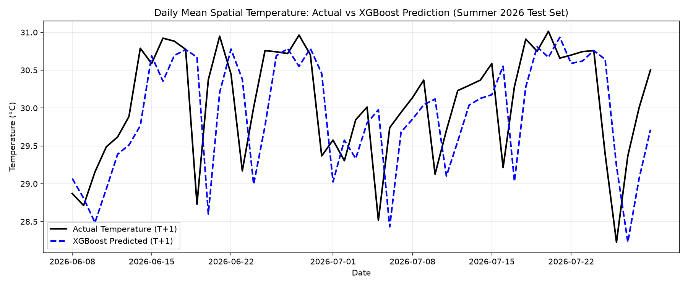
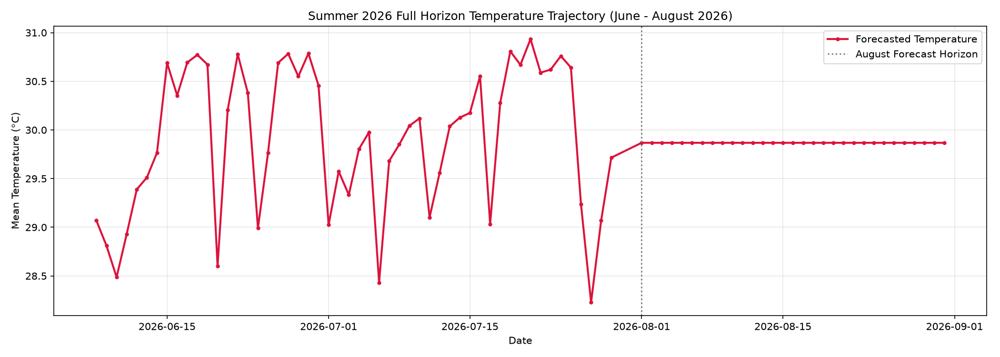
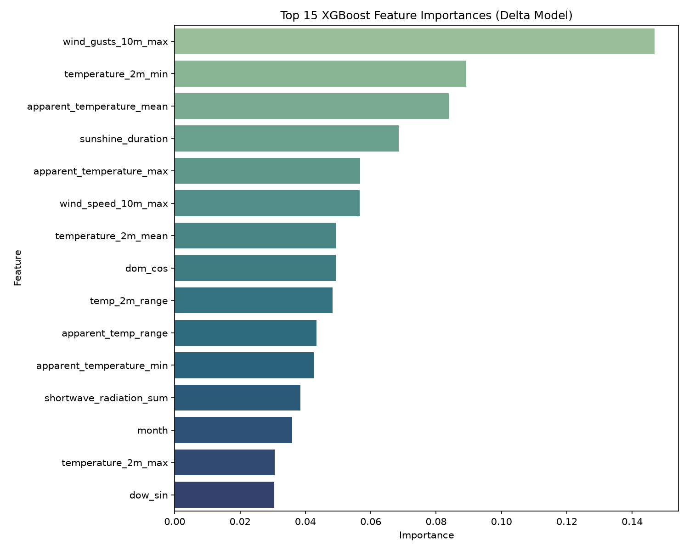
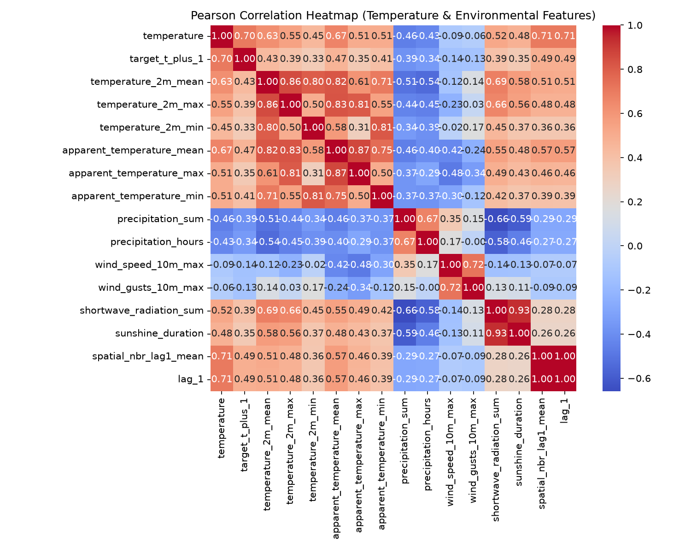
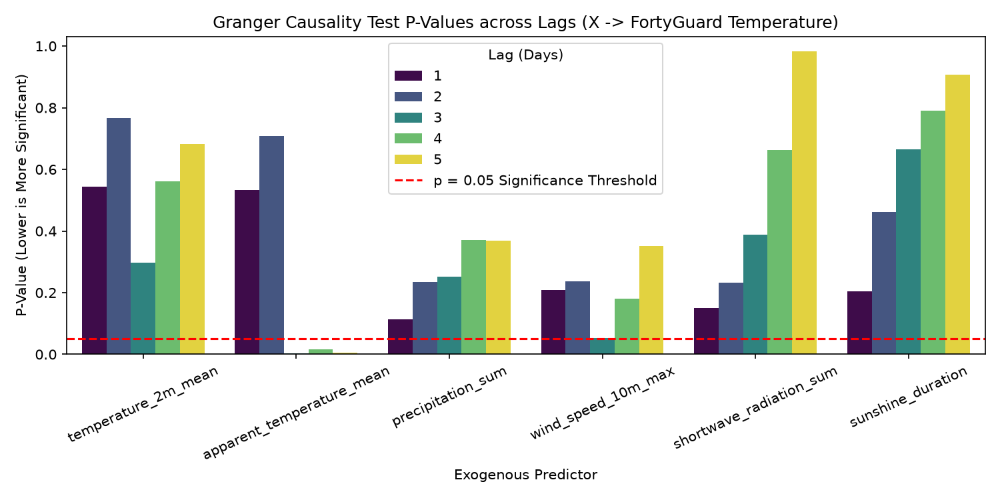

# Heat-Forexa
## Spatial ML Thermal Forecasting & Agentic AI Urban Mitigation Decision Support System (DSS)

[](https://heat-forexa.netlify.app/)
[](https://python.org)
[](https://reactjs.org)
[](https://fortyguard.com)

**Heat-Forexa** is an AI-driven, hyper-local urban microclimate forecasting and agentic decision-support platform designed for the Miami metro study area. By fusing FortyGuard's sub-hundred-meter spatial temperature tiles with Open-Meteo macro-meteorological and solar radiation datasets, Heat-Forexa enables urban planners, city officials, and climate resilience teams to predict urban heat island (UHI) intensity, discover causal environmental drivers, and simulate targeted heat mitigation strategies.

---

## 🔗 Live Demo
Access the interactive web dashboard live on Netlify:
**[https://heat-forexa.netlify.app/](https://heat-forexa.netlify.app/)**

---

## What We Did & How It Helps Users

### What We Built
1. **Multi-Source Microclimate Data Fusion Engine**: Ingests hyper-local spatial temperature tiles from the FortyGuard API (100m spatial granularity) and pairs each tile's coordinates with macro-level meteorological parameters from the Open-Meteo Archive API.
2. **Causal & Predictive Machine Learning Pipeline**: Implements time-series forecasting (Random Forest, Gradient Boosting, XGBoost, ARIMA/Prophet baselines) alongside Granger Causality tests and Feature Importance analysis to quantify environmental drivers of microclimate temperature spikes.
3. **Agentic Decision-Support System (DSS)**: Formulates targeted urban heat mitigation scenarios—such as cool roof retrofits, urban tree canopy expansion, and permeable pavements—providing quantified cooling projections (°C reduction) for specific locations.
4. **Interactive React + Leaflet Dashboard**: A modern, high-performance web dashboard featuring real-time spatial heatmaps, location forecasts, causal factor breakdowns, and interactive mitigation simulators.

### How It Helps Users
* **Urban Planners & City Officials**: Pinpoints extreme microclimate hot-spots down to 100m tiles rather than relying on coarse city-wide weather stations.
* **Climate Resilience Officers**: Evaluates intervention strategies (e.g., green roofs vs. shade structures) before deploying municipal budgets.
* **Real Estate Developers & Risk Analysts**: Screens properties and parcel portfolios for thermal risk and extreme heat exceedance.

---

## Innovation & Key Differentiators

| Feature | Standard Weather Models | Heat-Forexa Platform |
| :--- | :--- | :--- |
| **Spatial Resolution** | 10 km – 25 km grid cells | **100-meter hyper-local microclimate tiles** |
| **Data Fusion** | Macro weather variables only | **FortyGuard spatial TCM tiles + Open-Meteo macro weather & solar radiation** |
| **Causal Intelligence** | Correlation analysis only | **Granger Causality & Feature Importance for root-cause discovery** |
| **Decision Support** | Static risk maps | **Agentic DSS with action-oriented cooling impact simulations** |
| **User Interface** | Complex GIS software | **Zero-install responsive React web dashboard** |

---

## Data Fusion Architecture: FortyGuard + Open-Meteo

Heat-Forexa establishes a two-tiered data ingestion pipeline:

```text
       FortyGuard API (Spatial Tiles)             Open-Meteo Archive API (Macro Weather)
[100m TCM Tiles: lat, lon, avg/min/max temp]      [Temperature, Solar, Wind, Precipitation]
                    │                                                │
                    └───────────────────────┬────────────────────────┘
                                            ▼
                           Tile-Level Feature Matrix (Pandas/NumPy)
                                            │
                                            ▼
                       ML Forecasting & Causal Inference Models
                                            │
                                            ▼
                         React Dashboard & Agentic DSS Engine
```

### Open-Meteo Meteorological Data API
Using `https://archive-api.open-meteo.com/v1/archive`, the pipeline fetches historical and forecast weather parameters mapped to tile centroid coordinates (`latitude`, `longitude`):

```text
OPEN_METEO_URL = "https://archive-api.open-meteo.com/v1/archive"
```

**Retrieved Environmental Variables:**
* `temperature_2m_mean`, `temperature_2m_max`, `temperature_2m_min`
* `apparent_temperature_mean`, `apparent_temperature_max`, `apparent_temperature_min`
* `precipitation_sum`, `rain_sum`, `snowfall_sum`, `precipitation_hours`
* `wind_speed_10m_max`, `wind_gusts_10m_max`
* `shortwave_radiation_sum`, `sunshine_duration`

---

## FortyGuard API — Real Request & Response Example

Heat-Forexa uses the FortyGuard Heatmap API to retrieve spatial temperature data for the Miami study area. The API returns a GeoJSON `FeatureCollection` containing temperature information for individual spatial tiles.

### Environment Configuration

The FortyGuard API is configured through environment variables:

```env
FORTYGUARD_API_KEY=your_api_key_here
FORTYGUARD_BASE_URL=https://api.fortyguard.com
```

The actual API key is stored locally in `.env` and is **never committed to the repository**.

### Real API Request

The following request is taken from the actual data collection code used by Heat-Forexa:

```python
response = client.create_heatmap(
    polygon_aoi=MIAMI_POLYGON,
    start_date="2026-08-16",
    end_date="2026-08-16",
    filter_type=4,
    analytic_type="tcm",
    granularity=100,
)
```

**Request parameters:**

| Parameter | Value |
| --- | --- |
| `polygon_aoi` | Miami study-area polygon |
| `start_date` | `2026-08-16` |
| `end_date` | `2026-08-16` |
| `filter_type` | `4` |
| `analytic_type` | `tcm` |
| `granularity` | `100 m` |

### Real API Response

The following is an actual response returned by FortyGuard. The complete response contains additional tile features; the example below shows the first few returned features.

```json
{
  "map_data": {
    "type": "FeatureCollection",
    "features": [
      {
        "id": "0",
        "type": "Feature",
        "properties": {
          "tile_id": 0,
          "average_temperature": 30.0237,
          "min_temperature": 27.5529,
          "max_temperature": 33.2814
        },
        "geometry": {
          "type": "Polygon",
          "coordinates": [
            [
              [-80.20524153360346, 25.756727493013738],
              [-80.20423651593268, 25.756722003268365],
              [-80.20423048185016, 25.757627304165407],
              [-80.20523550713979, 25.7576327941315],
              [-80.20524153360346, 25.756727493013738]
            ]
          ]
        }
      },
      {
        "id": "1",
        "type": "Feature",
        "properties": {
          "tile_id": 1,
          "average_temperature": 28.138,
          "min_temperature": 25.9084,
          "max_temperature": 33.155
        },
        "geometry": {
          "type": "Polygon",
          "coordinates": [
            [
              [-80.2162908045048, 25.75769272594986],
              [-80.21528577602541, 25.757687312285345],
              [-80.21527982546569, 25.758592615481113],
              [-80.21628486156439, 25.75859802936328],
              [-80.2162908045048, 25.75769272594986]
            ]
          ]
        }
      },
      {
        "id": "2",
        "type": "Feature",
        "properties": {
          "tile_id": 2,
          "average_temperature": 28.285,
          "min_temperature": 26.0359,
          "max_temperature": 33.1602
        },
        "geometry": {
          "type": "Polygon",
          "coordinates": [
            [
              [-80.2152857760254, 25.757687312285345],
              [-80.21428074783415, 25.75768189168429],
              [-80.21427478965512, 25.758587194662123],
              [-80.21527982546569, 25.758592615481113],
              [-80.2152857760254, 25.757687312285345]
            ]
          ]
        }
      }

    ]
  }
}
```

### How Heat-Forexa Uses the Response

The returned GeoJSON features are processed to extract the tile-level temperature and geographic information:

```text
FortyGuard API
      ↓
GeoJSON FeatureCollection
      ↓
Individual spatial tiles
      ↓
tile_id + temperature + geometry
      ↓
Tile center latitude/longitude
      ↓
ML-ready temperature dataset
```

The project converts the FortyGuard response into records containing:

```text
tile_id
timestamp
latitude
longitude
temperature
```

The `temperature` value is extracted from the TCM temperature fields returned by FortyGuard.

### API Key Security

The actual FortyGuard API key is **not included** in this example or repository. It is supplied through the local `.env` file using:

```env
FORTYGUARD_API_KEY=your_api_key_here
FORTYGUARD_BASE_URL=https://api.fortyguard.com
```

---

## Machine Learning Output Figures & Visualizations

Below are the 5 core analytical output figures generated by the Heat-Forexa ML pipeline:

### 1. Actual vs. Predicted Temperature (Summer 2026 Validation)
This figure evaluates the accuracy of the trained XGBoost model against actual daily spatial mean temperature values during the Summer 2026 test set.



---

### 2. Summer 2026 Full Horizon Forecast Trajectory (June – August 2026)
This trajectory shows the forecasted temperature trend across the entire summer season, highlighting extreme heat peak periods and August forward predictions.



---

### 3. Top 15 XGBoost Feature Importances (Delta Model)
This output chart illustrates the relative contribution of each meteorological and spatial variable to the model's predictions. Peak wind gusts (`wind_gusts_10m_max`), minimum 2m temperature (`temperature_2m_min`), and apparent mean temperature (`apparent_temperature_mean`) emerge as top predictive drivers.



---

### 4. Environmental Feature Correlation Heatmap
The correlation matrix reveals linear dependencies across macro-meteorological attributes, solar radiation sums, and hyper-local spatial temperature metrics.



---

### 5. Granger Causality p-values Matrix
This statistical matrix measures directionality and causal influence across lagged weather parameters and microclimate temperature anomalies.



---

## How to Run the Project

### Prerequisites
* **Python 3.10+**
* **Node.js 18+** & **npm**

---

### 1. Running the Machine Learning Pipeline (Python)

1. **Clone the repository:**
   ```bash
   git clone https://github.com/Farjana3/Heat-Forexa.git
   cd Heat-Forexa
   ```

2. **Create and activate a virtual environment:**
   ```bash
   python -m venv venv
   # On Windows (PowerShell):
   .\venv\Scripts\Activate.ps1
   # On Linux/macOS:
   source venv/bin/activate
   ```

3. **Install dependencies:**
   ```bash
   pip install -r requirements.txt
   ```

4. **Set up Environment Variables:**
   Copy `.env.example` in `temperature-api-quickstart` or root directory to `.env` and add your FortyGuard API credentials:
   ```env
   FORTYGUARD_API_KEY=your_actual_api_key
   FORTYGUARD_BASE_URL=https://api.fortyguard.com
   ```

5. **Execute Processing and Analysis Scripts:**
   ```bash
   # Run Feature Engineering
   python src/processing/features.py

   # Run Causal Inference Analysis
   python src/analysis/causal.py

   # Run ML Model Training & Forecasting
   python src/analysis/modeling.py
   python src/analysis/forecast_2027.py
   ```

6. **(Optional) Run Jupyter Notebooks:**
   ```bash
   jupyter notebook notebooks/
   ```

---

### 2. Running the React Dashboard (Frontend)

1. **Navigate to the frontend directory:**
   ```bash
   cd frontend
   ```

2. **Install Node.js dependencies:**
   ```bash
   npm install
   ```

3. **Start the local development server:**
   ```bash
   npm run dev
   ```
   Open your browser at `http://localhost:5173`.

4. **Build for production:**
   ```bash
   npm run build
   ```

---

## What Doesn't Work Yet / Future Roadmap

While Heat-Forexa delivers a functional ML pipeline and interactive dashboard, the following limitations are actively being addressed:

* **Real-Time Automated Sensor Polling**: The current pipeline runs on scheduled daily batch syncs rather than live streaming WebSocket feeds.
* **Multi-City Global Spatial Models**: Current pre-processed models are calibrated specifically for the Miami metro region; extending to other cities requires acquiring regional spatial polygons.
* **3D Urban Canopy Height Modeling**: The tile geometry currently operates on 2D polygon centroids; incorporation of LiDAR-based 3D building height data is planned for V2.
* **Automated ML Retraining CI/CD Pipeline**: Model retraining is triggered manually via Python scripts rather than an automated GitHub Actions cron workflow.

---

## Repository Structure

```text
Heat-Forexa/
├── data/                            # Raw & processed microclimate datasets
├── frontend/                        # React + Vite web dashboard application
│   ├── public/                      # Static web assets
│   ├── src/
│   │   ├── components/              # Map, DSS, Forecast, & Sidebar components
│   │   ├── services/                # API clients, causal agents, & mitigation models
│   │   └── App.jsx                  # Main dashboard interface
│   └── package.json
├── notebooks/                       # Jupyter analytical notebooks (01-04)
├── output/
│   ├── figure/                      # Generated ML charts, heatmaps, & trajectories
│   └── result/                      # Evaluation metrics CSVs & model weights JSON
├── src/
│   ├── analysis/                    # Causal, modeling, & forecast scripts
│   └── processing/                  # Data quality & feature engineering modules
├── temperature-api-quickstart/      # FortyGuard API client & usage templates
├── requirements.txt                 # Python dependencies
├── LICENSE                          # MIT License
└── README.md                        # Project documentation
```

---

## License
This project is licensed under the [MIT License](LICENSE).
